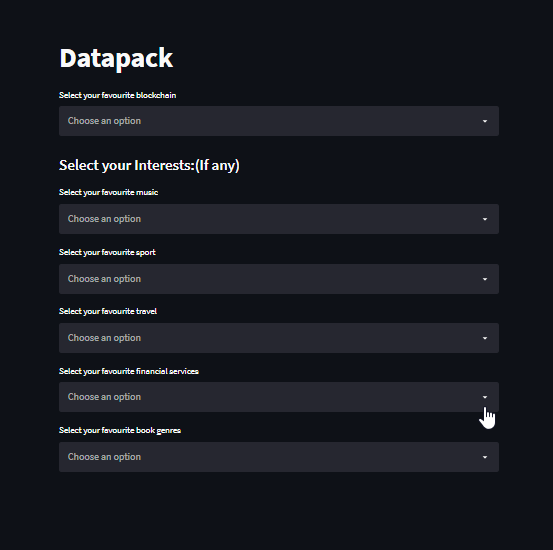
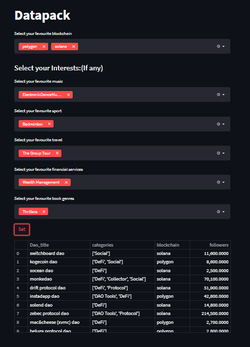

# DAO-Recommendation

## Documentation

[Data-Pack-Documentation](https://docs.google.com/document/d/1rC8gX94hyrQdGD2GhDgvm0l4uNMDx9src6QonSsHpXA/edit?usp=sharing)

## Setup

We built a reccomendation model for the DAOs.
- Run the app.py file with the required modules.
-- Python app.py
- Run the app_profile.py file to run the background porfile recorder.
-- python -m streamlit run app_profile.py

This will open two files.
running at:
Main website: http://localhost:5000
Profile server: http://localhost:8502

Based on following category we provide reccomendations.
such as:
- Description
- Category
- Followers
- About
- Similar Daos
- chain
- holder
- transactions 
- price

## Main Page

## Profile Page

## Reccomendations

## Customized Main Page

